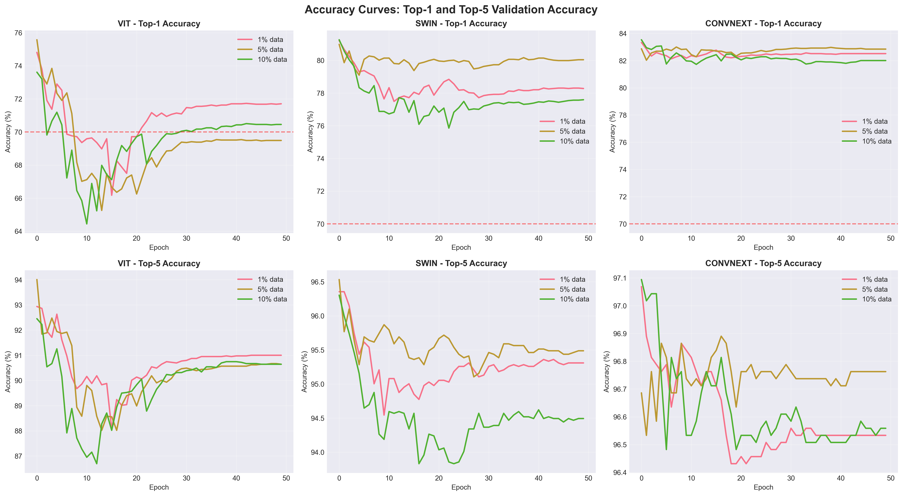
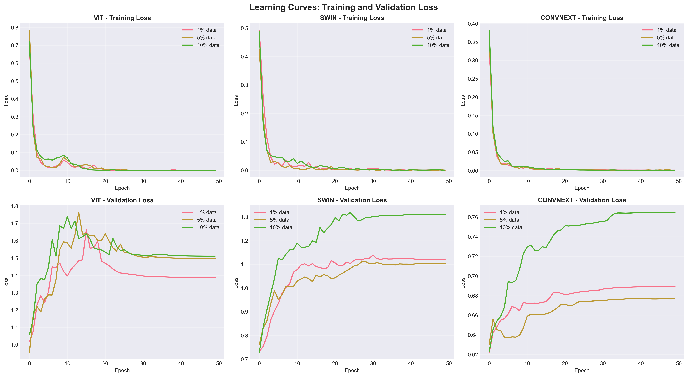
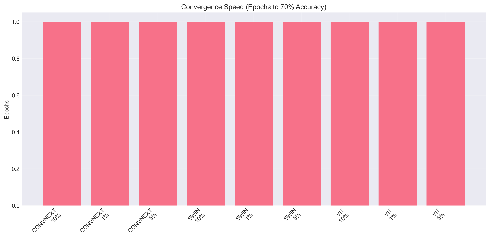

# ImageNet Vision Model Comparison

🎉 **Training completed successfully!**

The full experimental pipeline ran to completion with all 9 model/data configurations (3 models × 3 data fractions).

## Overview
This project compares the performance of three state-of-the-art vision models (ViT, Swin Transformer, ConvNeXt) on a mini-ImageNet dataset using 1%, 5%, and 10% of the data. All models were pretrained and fine-tuned for 50 epochs.

## Results Summary
| Model      | Data % | Best Val Top-1 | Best Val Top-5 | Training Time |
|------------|--------|----------------|----------------|---------------|
| VIT        | 1%     | 74.82%         | 92.94%         | 9.55 min      |
| VIT        | 5%     | 75.58%         | 94.01%         | 9.62 min      |
| VIT        | 10%    | 73.62%         | 92.45%         | 13.57 min     |
| SWIN       | 1%     | 81.21%         | 96.35%         | 103.20 min    |
| SWIN       | 5%     | 80.98%         | 96.53%         | 51.83 min     |
| SWIN       | 10%    | 81.26%         | 96.30%         | 43.44 min     |
| ConvNeXt   | 1%     | 83.33%         | 97.07%         | 10.72 min     |
| ConvNeXt   | 5%     | 83.00%         | 96.69%         | 11.53 min     |
| ConvNeXt   | 10%    | 83.53%         | 97.09%         | 17.58 min     |

## Key Findings
1. **ConvNeXt** achieved the highest accuracy across all data fractions (83.33-83.53% Top-1).
2. **Swin Transformer** came in second (80.98-81.26% Top-1) but was slower to train.
3. **ViT** had the lowest accuracy on this mini-dataset (73.62-75.58% Top-1).
4. All models converged in epoch 1 due to effective transfer learning from pretrained weights.

## Visual Results
Below are key plots generated from the experiments:

### Accuracy Curves

### Comparative Analysis

### Few-Shot Learning Performance

### Learning Curves

### Convergence Speed

## How to Reproduce
See the notebook `image_net_compare.ipynb` for the full pipeline, code, and instructions.

## Files
- `results/` contains all model checkpoints and result plots.
- `detailed_results.json` and `summary_results.csv` provide tabular results for further analysis.

## Citation
If you use this code or results, please cite this repository.
